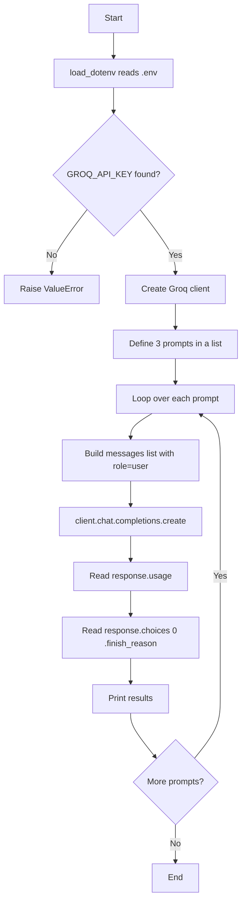

<div align="center">

# ⚡ Groq Token Usage & Finish Reason Explorer

**A tiny Python script that sends multiple prompts to a Groq-hosted LLM and reports token usage and *why* each response ended.**


</div>

---

## 📑 Table of Contents

- [Overview](#-overview)
- [Features](#-features)
- [Project Structure](#-project-structure)
- [Setup](#-setup)
- [Usage](#-usage)
- [How the Code Works](#-how-the-code-works)
- [Understanding `finish_reason`](#-understanding-finish_reason)
- [Experiment: Trigger `length`](#-experiment-trigger-length)
- [Sample Output](#-sample-output)
- [Troubleshooting](#-troubleshooting)
- [Next Steps](#-next-steps)

---

## 🔍 Overview

This script loops through three prompts of very different sizes and, for each one, prints:

| Field | Meaning |
|---|---|
| `prompt_tokens` | Tokens in **your input** |
| `completion_tokens` | Tokens in the **model's output** |
| `total_tokens` | `prompt_tokens + completion_tokens` |
| `finish_reason` | **Why** the model stopped generating |

It is a great starting point for learning about **token accounting**, **cost estimation**, and **response truncation**.

## ✨ Features

- 🔐 Secure API key loading from a `.env` file
- 📨 Sends multiple prompts in a loop (short, medium, long)
- 📊 Prints token usage for every request
- 🛑 Shows the `finish_reason` so you can detect truncated answers
- 🧪 Includes a commented `max_tokens=50` example to force truncation

## 📁 Project Structure

```
.
├── main.py          # The script
├── .env             # Your secret API key (never commit this!)
├── .gitignore       # Should include .env
├── requirements.txt # Dependencies
└── README.md
```

## 🛠 Setup

### 1. Clone and enter the project

```bash
git clone <your-repo-url>
cd <your-repo-folder>
```

### 2. Create a virtual environment (recommended)

```bash
python -m venv venv

# macOS / Linux
source venv/bin/activate

# Windows
venv\Scripts\activate
```

### 3. Install dependencies

```bash
pip install groq python-dotenv
```

Or with a `requirements.txt`:

```txt
groq
python-dotenv
```

```bash
pip install -r requirements.txt
```

### 4. Add your API key

Get a key from the [Groq Console](https://console.groq.com/keys), then create a `.env` file:

```env
GROQ_API_KEY=your_groq_api_key_here
```

> ⚠️ Add `.env` to your `.gitignore` so your key is never pushed to GitHub.

## ▶️ Usage

```bash
python main.py
```

---

## 🧠 How the Code Works

### Step-by-step flow



### Code walkthrough

| Section | What it does |
|---|---|
| `load_dotenv()` | Loads variables from `.env` into the environment |
| `os.getenv("GROQ_API_KEY")` | Reads the key; the script raises an error if it is missing |
| `Groq(api_key=...)` | Creates the API client used for all requests |
| `model = "openai/gpt-oss-20b"` | The model that will answer every prompt |
| `prompts = [...]` | Three prompts: a greeting, a detailed explanation, and a 1000-word essay |
| `for pmt in prompts` | Sends each prompt as a separate, independent request |
| `msg = {"role": "user", "content": pmt}` | A single chat message in the format the API expects |
| `response.usage` | Object holding the token counts |
| `response.choices[0].finish_reason` | The reason the generation ended |

> 💡 Each prompt is sent in its **own** request with a fresh `messages` list, so the model has no memory of earlier prompts.

### The three prompts

| # | Prompt | Expected size | Expected `finish_reason` |
|---|---|---|---|
| 1 | `"Hi!"` | Very short | `stop` |
| 2 | `"Explain time travel in Detail"` | Medium-long | `stop` |
| 3 | `"Write a 1000 word essay on Machine learning"` | Long | `stop` (or `length` if the token cap is hit) |

---

## 🛑 Understanding `finish_reason`

The `finish_reason` field tells you **why the model stopped writing**. Checking it is essential for knowing whether an answer is complete.

### Quick reference

| Value | Icon | Meaning | Is the answer complete? |
|---|:---:|---|:---:|
| `stop` | ✅ | The model finished naturally, or hit a stop sequence | ✅ Yes |
| `length` | ✂️ | The output hit the token limit (`max_tokens` or the model's context limit) | ❌ No, cut off |
| `tool_calls` | 🔧 | The model wants to call a function/tool you defined | ➡️ Waiting on your tool result |
| `content_filter` | 🚫 | Output was stopped by a safety or content filter | ❌ No |

This script mainly demonstrates the first two: **`stop`** and **`length`**.

### ✅ `finish_reason = "stop"`

**What it means:** the model reached a natural end of its answer (or emitted a stop sequence). Nothing was cut off.

**When it happens in this script:**

- `"Hi!"` → a short greeting, so the model finishes quickly.
- `"Explain time travel in Detail"` → a long answer, but it fits within the token limit, so it ends naturally.

**What you should do:** nothing. The response is complete and safe to use.

```text
Finish Reason: stop
```

### ✂️ `finish_reason = "length"`

**What it means:** generation was **stopped early** because the maximum number of tokens was reached. The text may end **mid-sentence**, or an essay may be missing its conclusion.

**When it happens:**

1. You set `max_tokens` too low (for example `max_tokens=50`).
2. The response is so long that it reaches the model's maximum output or context limit.

**What you should do:**

- Increase `max_tokens`.
- Ask for a shorter answer.
- Split the task into smaller requests.
- Continue the response by sending the partial answer back and asking the model to continue.

```text
Finish Reason: length
```

### ⚖️ Side-by-side comparison

| | ✅ `stop` | ✂️ `length` |
|---|---|---|
| Cause | Model decided it was done | Token limit reached |
| Answer complete? | Yes | Often **no** |
| Who controls it? | The model | You (`max_tokens`) and model limits |
| `completion_tokens` | Below the limit | **Equal to** (or very near) the limit |
| Typical fix | None needed | Raise `max_tokens` or shorten the request |

### 🧩 Handling it in code

Add a small check after each response:

```python
choice = response.choices[0]

if choice.finish_reason == "stop":
    print("✅ Complete response")
elif choice.finish_reason == "length":
    print("✂️ Response was truncated. Increase max_tokens or shorten the prompt.")
elif choice.finish_reason == "tool_calls":
    print("🔧 Model requested a tool call")
else:
    print(f"⚠️ Ended with: {choice.finish_reason}")
```

---

## 🧪 Experiment: Trigger `length`

The script contains a commented-out block:

```python
# response = client.chat.completions.create(
#     model=model,
#     messages=messages,
#     max_tokens=50
# )
```

**Try it:**

1. Comment out the original `client.chat.completions.create(...)` call.
2. Uncomment the block above.
3. Run the script again.

**What to expect:**

| Prompt | `completion_tokens` | `finish_reason` |
|---|---|---|
| `Hi!` | Small (may finish under 50) | `stop` |
| `Explain time travel in Detail` | ~50 | `length` |
| `Write a 1000 word essay...` | ~50 | `length` |

> 🧠 **Note on reasoning models:** `openai/gpt-oss-20b` is a reasoning model. It may spend part of its token budget on internal "thinking" before writing the visible answer. With a very small `max_tokens`, you might get a `length` finish with **little or no visible text**, and `completion_tokens` can include those reasoning tokens.

---

## 📤 Sample Output

Exact numbers will vary between runs.

```text
#########################################
Prompt: Hi!
your tokens: 71
completion_tokens: 45
total tokens: 116
Finish Reason: stop
#########################################
Prompt: Explain time travel in Detail
your tokens: 78
completion_tokens: 1450
total tokens: 1528
Finish Reason: stop
#########################################
Prompt: Write a 1000 word essay on Machine learning
your tokens: 83
completion_tokens: 2100
total tokens: 2183
Finish Reason: stop
```

With `max_tokens=50`:

```text
#########################################
Prompt: Explain time travel in Detail
your tokens: 78
completion_tokens: 50
total tokens: 128
Finish Reason: length
```

---

## 🩺 Troubleshooting

| Problem | Likely cause | Fix |
|---|---|---|
| `ValueError: GROQ_API_KEY not found in .env` | Missing `.env` or wrong variable name | Create `.env` with `GROQ_API_KEY=...` in the same folder you run the script from |
| `ModuleNotFoundError: groq` | Package not installed | `pip install groq python-dotenv` |
| `401 Unauthorized` | Invalid or expired key | Generate a new key in the Groq Console |
| `429 Too Many Requests` | Rate limit hit | Wait and retry, or reduce request frequency |
| `model_not_found` | Model name changed or unavailable | Check the current model list in the Groq docs |
| Answer cut off mid-sentence | `finish_reason` is `length` | Increase `max_tokens` |

## 🚀 Next Steps

- [ ] Add a `max_tokens` variable and compare results at several values
- [ ] Calculate an estimated **cost** from token counts
- [ ] Print the model's **actual response text** (`response.choices[0].message.content`)
- [ ] Add a system prompt and observe how `prompt_tokens` changes
- [ ] Log results to a CSV for comparison
- [ ] Add retry logic and error handling

## 📚 Resources

- [Groq Documentation](https://console.groq.com/docs)
- [Groq Python SDK](https://github.com/groq/groq-python)
- [python-dotenv](https://pypi.org/project/python-dotenv/)

---

<div align="center">

Made with ☕ and curiosity about tokens.

</div>
